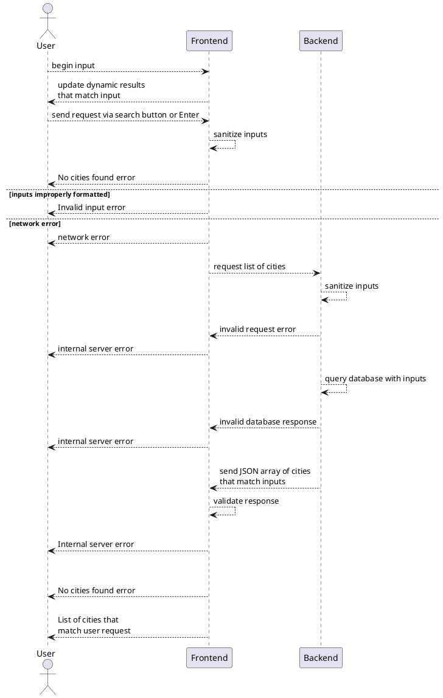

# uscities-search-gemini

This project aims to recreate a US cities search application using Gemini. 
The purpose of the site is to query https://slutskcp-uscities-microservices-ddgpeagnc6czh6dd.canadacentral-01.azurewebsites.net/ with user input and to display the results. 

## Project Overview

- **Purpose:** Create a search tool where users can search for uscities by city name or zip code and receive all matching entries in retrun.
- **Technology:** HTML, CSS, Vanilla JavaScript, Gemini.
- **Deployment:** GitHub Pages via GitHub Actions.

## Expanded Use Case

### Brief User Description
User has the ability to search for US cities by zip code or name, and retrieve a list of all cities that match the inputted zip code or name. 

#### Backend Routes
 - `GET uscities-search/<zip-code>` - returns json array of cities that contain that zip code
 - `GET uscities-search/<city-name>` - returns json array of cities that partially match that name

#### Example JSON Response
```json
{
  "city":"Cincinnati",
  "state_id":"OH",
  "state_name":"Ohio",
  "county_name":"Hamilton",
  "timezone":"America/New_York",
  "zips":"45267 45203 45207 45211 45219 45230 45223 45227 45204 45205 45206 45208 45209 45213 45202 45216 45217 45220 45224 45232 45233 45237 45238 45239 45225 45214 45226 45212 45229 45201 45250 45254 45262 45275 45221 45263 45264 45268 45269 45270 45271 45273 45274 45296 45298 45299 45999"
}
```

### User Stories
 - [x] US-01: As a user, I want to be able to input a zip code and retrieve a list of US cities that contain that zip code, or to input a city name and retrieve a list of US cities that (partially) contain that name
 - [x] US-02: As a user, I want the results to update dynamically as I type so that I can see matching cities immediately without needing to click a search button or select from a dropdown.
 - [x] US-03: As a user, I want this application to have basic security in terms of injection attacks. 

### Acceptance Criteria
 - [x] AC-01: Properly inputted zip code returns JSON array of cities that match the input
 - [x] AC-02: Properly inputted city name (full or partial) returns list of cities who's names contain that input
 - [x] AC-03: Improperly formatted inputs display an error
 - [x] AC-04: Proper inputs that return no results displays "No cities found"
 - [x] AC-05: Network error does not cause page to crash, fails safely
 - [x] AC-06: Inputs from user are sanitized / validated before being sent to backend service
 - [x] AC-07: Inputs from backend service are sanitized / validated before being displayed to user
 - [x] AC-08: When the user types a keystroke, the results grid is dynamically updated with cities that match the current input.
 - [x] AC-09: When the user enters keystrokes rapidly, the results are updated after a brief delay (debounced) to ensure performance and reduce API load.
 - [x] AC-10: Inputs from frontend service are sanitized / validated by backend service before being used to query database

### Sequence Diagram


### Plantuml code



## Building and Running

- **Local Development:**
  - Run the application with
    ```bash
    # Using Python
    python -m http.server 8080
    ```
    to be displayed in the google cloud shell
- **Build:** Currently, there is no build process as it is a pure static site.
- **Testing:** No formal testing suite is currently implemented.

## Deployment

The project is configured for automated deployment to GitHub Pages.
- **Workflow:** `.github/workflows/static.yml`
- **Trigger:** Pushes to the `main` branch.

## Development Conventions

- **Simplicity:** Maintain a clean and minimal structure as the project evolves. Prefer simple solutions to more complicated ones.
- **Documentation:** Keep this `GEMINI.md` file updated as new technologies or architectures are introduced.
- **Gemini Integration:** Future development should leverage Gemini for enhancing search capabilities or recreating features.
- **Vanilla JavaScript** Avoid using external dependencies and library as much as possible, and stick to vanilla JavaScript, HTML, and CSS.
- **Humans Manage Git and Deployment** Avoid automatic git commits and pushes, as well as deployments. For now, let humans do that.
